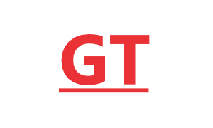
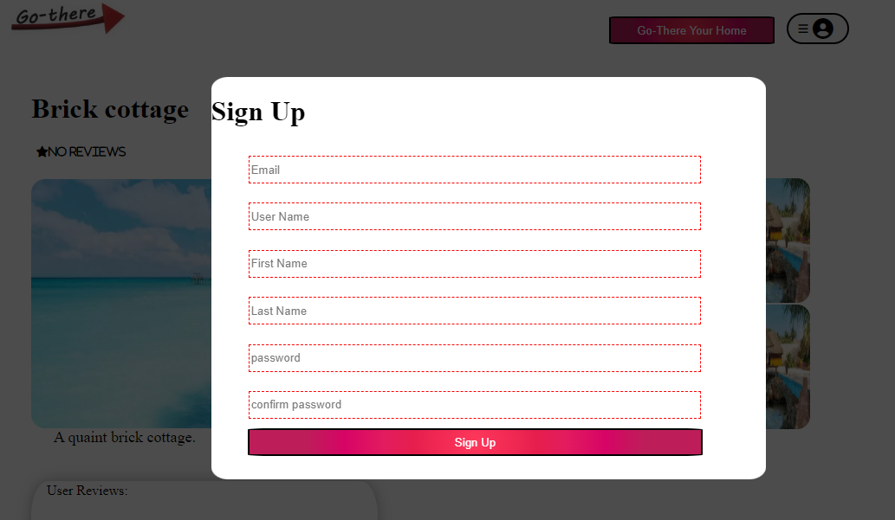
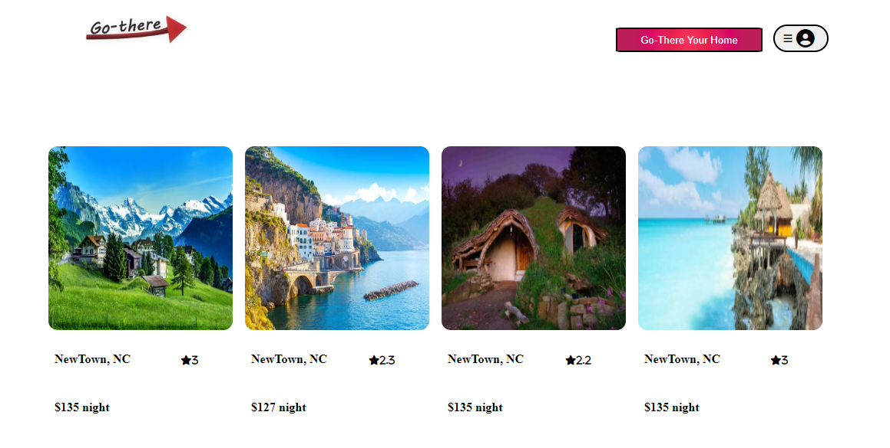
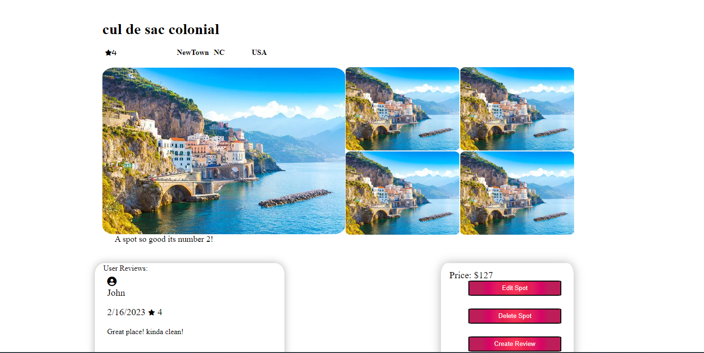
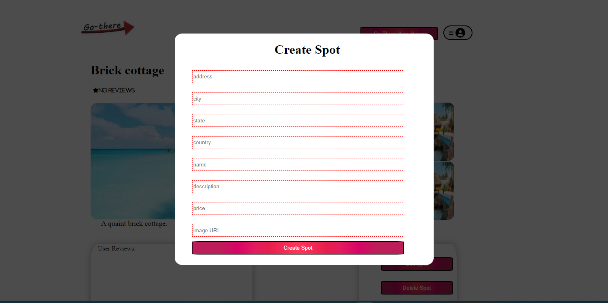

<!-- Improved compatibility of back to top link: See: https://github.com/othneildrew/Best-README-Template/pull/73 -->
<a name="readme-top"></a>
<!--
*** Thanks for checking out the Best-README-Template. If you have a suggestion
*** that would make this better, please fork the repo and create a pull request
*** or simply open an issue with the tag "enhancement".
*** Don't forget to give the project a star!
*** Thanks again! Now go create something AMAZING! :D
-->

<br />
<div align="center">
  <a href="https://github.com/PatrickMcK34/API-project">
    
  </a>

<h3 align="center">Go-There</h3>

  <p align="center">
    A clone of the popular AirBnB web application. Go-there is a marketplace designed to allow owners of rental properties to make their spots available to the public as well as allowing the public to view and reserve time at their desired location.
    <br />
    <a href="https://github.com/PatrickMcK34/API-project"><strong>Explore the docs »</strong></a>
    <br />
    <br />
    <a href="https://github.com/PatrickMcK34/API-project/issues">Report Bug</a>
    ·
    <a href="https://github.com/PatrickMcK34/API-project/issues">Request Feature</a>
  </p>
</div>


<!-- TABLE OF CONTENTS -->
<details>
  <summary>Table of Contents</summary>
  <ol>
    <li>
      <a href="#about-the-project">About The Project</a>
      <ul>
        <li><a href="#built-with">Built With</a></li>
      </ul>
    </li>
    <li>
      <a href="#getting-started">Getting Started</a>
      <ul>
        <li><a href="#prerequisites">Prerequisites</a></li>
        <li><a href="#installation">Installation</a></li>
      </ul>
    </li>
    <li><a href="#usage">Usage</a></li>
    <li><a href="#roadmap">Roadmap</a></li>
    <li><a href="#contributing">Contributing</a></li>
    <li><a href="#license">License</a></li>
    <li><a href="#contact">Contact</a></li>
    <li><a href="#acknowledgments">Acknowledgments</a></li>
  </ol>
</details>


<!-- ABOUT THE PROJECT -->
## About The Project
`A clone of the popular AirBnB web application. Go-there is a marketplace designed to allow owners of rental properties to make their spots available to the public as well as allowing the public to view and reserve time at their desired location.`

<p align="right">(<a href="#readme-top">back to top</a>)</p>


### Built With


* React
* JavaScript
* SQL
* Express


<p align="right">(<a href="#readme-top">back to top</a>)</p>


<!-- GETTING STARTED -->
## Getting Started
.
To get a local copy up and running follow these simple example steps.

### Prerequisites
* npm -
  npm install

### Installation


1. Clone the repo
   ```sh
   git clone https://github.com/PatrickMcK34/API-project.git
   ```
2. Install NPM packages
   ```sh
   npm install
   ```
3. Navigate into the backend folder and from there use the command npm start to start the backend server.

4. Create an additional terminal window and navigate to the frontend folder. From here use npm start again to launch the frontend of the application.


<p align="right">(<a href="#readme-top">back to top</a>)</p>


<!-- USAGE EXAMPLES -->
## Usage



Create your account with secure hashed password protection.



The home page displays each spot with thumbnails with only minimum infomation. Click to see more.



Once in the details page the user may create a review, manage their own spot or by using the Go-There button in the Nav bar, create a new spot.



With validation in place and suggestions prepopulating the forms, creating a new Spot is simple.
_For more examples, please refer to the [Documentation](https://example.com)_

<p align="right">(<a href="#readme-top">back to top</a>)</p>


<!-- ROADMAP -->
## Roadmap

- [ ] Spots
- [ ] Reviews


See the [open issues](https://github.com/PatrickMcK34/API-project/issues) for a full list of proposed features (and known issues).

<p align="right">(<a href="#readme-top">back to top</a>)</p>


<!-- CONTRIBUTING -->
## Contributing

Contributions are what make the open source community such an amazing place to learn, inspire, and create. Any contributions you make are **greatly appreciated**.

If you have a suggestion that would make this better, please fork the repo and create a pull request. You can also simply open an issue with the tag "enhancement".
Don't forget to give the project a star! Thanks again!

1. Fork the Project
2. Create your Feature Branch (`git checkout -b feature/AmazingFeature`)
3. Commit your Changes (`git commit -m 'Add some AmazingFeature'`)
4. Push to the Branch (`git push origin feature/AmazingFeature`)
5. Open a Pull Request

<p align="right">(<a href="#readme-top">back to top</a>)</p>


<p align="right">(<a href="#readme-top">back to top</a>)</p>


<!-- CONTACT -->
## Contact

Patrick McKinney  CorkscrewHollow@gmail.com

Project Link: [https://github.com/PatrickMcK34/API-project](https://github.com/PatrickMcK34/API-project)

<p align="right">(<a href="#readme-top">back to top</a>)</p>


<!-- ACKNOWLEDGMENTS -->


<p align="right">(<a href="#readme-top">back to top</a>)</p>

[React.js]: https://img.shields.io/badge/React-20232A?style=for-the-badge&logo=react&logoColor=61DAFB
[React-url]: https://reactjs.org/

